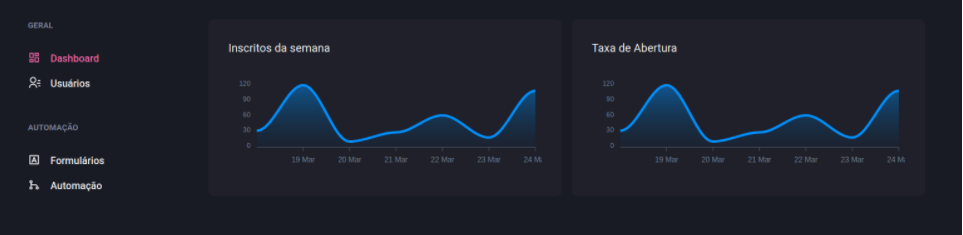

<h1 align="center">
DashGo.
</h1>

## 💻 Sobre o projeto

dashgo é o quarto projeto criado no chapter 4 da trilha de React do Ignite da Rocketseat. O projeto consiste em desenvolver uma aplicação Dashboard utilizando Chakra UI.


## 🖼 Screenshot da tela da aplicação

<br>

<br>

<br>

## 🛠 Tecnologias

As seguintes ferramentas foram usadas na construção do projeto:

### **Front-end**

<br>
- [x] React<br>
- [x] Typescript<br>
- [x] NextJS<br>
- [x] MirageJS<br>
- [x] Chakra UI<br>
- [x] Axios<br>
- [x] ESLint<br>
- [x] Prettier<br>
<br>

## 👷 Como rodar

```bash
# Clonar o repositório
https://github.com/MarcelFeo/ignite-rocketseat-dashgo.git

# Entrar numa IDE de sua preferência 

# Acessar a pasta do projeto

# Baixe as dependendências
yarn

# Execute o projeto
yarn start

```

Feito isso, abra o seu navegador e acesse `http://localhost:3000/`
ou em uma porta de sua preferência.
